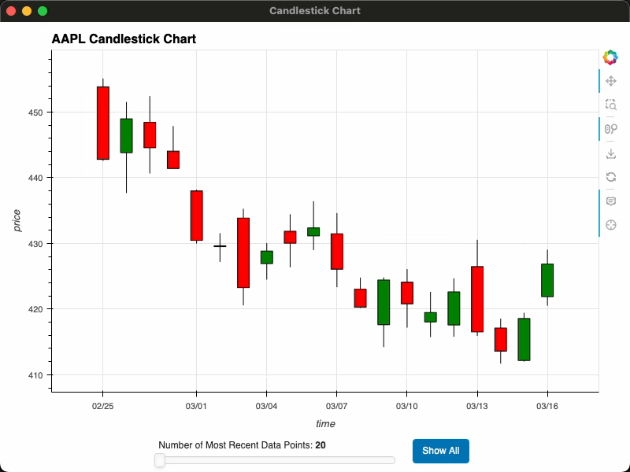
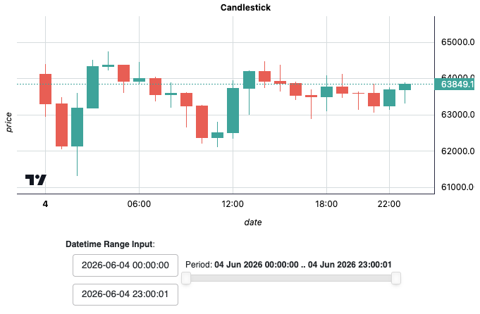

# PFund-Plot: Financial Charts in One Line of Code

[](https://discord.gg/vqpS94tpdp)
[](https://x.com/pfund_ai)
[](https://pepy.tech/project/pfund-plot)
[](https://pypi.org/project/pfund-plot)

[](https://afterpython.org)
[](https://github.com/PFund-Software-Ltd/pfund-plot/discussions)
[](https://jupyter.org)
[](https://marimo.io)
[](https://deepwiki.com/PFund-Software-Ltd/pfund-plot)
[](https://codewiki.google/github.com/pfund-software-ltd/pfund-plot?utm_source=badge&utm_medium=github&utm_campaign=github.com/pfund-software-ltd/pfund-plot)
<!--  -->
<!--  -->


## TL;DR: pfund-plot handles the plotting libraries, so traders just get charts that work

## Problem
Traders often need to quickly visualize their data without investing time in learning new tools.
For example, plotting a candlestick should be as simple as writing a single line of code.

## Solution
We created a high-level financial visualization layer that combines the best features from existing plotting libraries into an easy-to-use interface.

---


---

`pfund-plot` is a financial visualization layer on top of existing plotting libraries, giving traders a simple, domain-specific interface for plotting and streaming market data.

## Core Features
- [x] Multi-Display Mode: support displaying plots in a *Jupyter notebook*, *Marimo notebook*, *browser* and *desktop window*
- [x] Intuitive & Chainable API: `plt.ohlc(df).style(...).control(...).mode(...).show()`
- [x] Streaming Plots: support streaming data in real-time
- [x] DataFrame Agnostic: support pandas, polars, and dask
- [x] Financial Plots: plot financial data by just one function call
- [x] Combine multiple plots into a dashboard quickly for visualization


## Installation
```bash
pip install pfund-plot
```

## Quickstart
### 1. Plotting in a Jupyter or Marimo Notebook
> To use data sources other than Bybit, please go to [pfeed](https://github.com/PFund-Software-Ltd/pfeed) and install the corresponding extras. For example: `pip install "pfeed[data_source1, data_source2]"`
```python
import pfeed as pe
import pfund_plot as plt

feed = pe.Bybit().market_feed
result = feed.download(product='BTC_USDT_PERP', resolution='1h', rollback_period='1d')
df = result.data.collect()

# Notebook mode:
plt.ohlc(df)
```

### 2. Plotting in a Python Script
```python
# Browser mode:
plt.ohlc(df).mode('browser').show()

# Desktop mode:
if __name__ == "__main__":  # Required because desktop mode uses multiprocessing.
    plt.ohlc(df).mode('desktop').show()
```

### 3. Streaming a Plot
```python
# Streaming requires pipeline_mode=True.
feed = pe.Bybit(pipeline_mode=True).market_feed
feed.stream(product='BTC_USDT_PERP', resolution='1s')

# In a Python script:
plt.ohlc(feed).control(update_interval=1000).mode('browser')  # or mode('desktop') under if __name__ == "__main__"

# In a notebook environment (not recommended to start streaming in a notebook unless you know what you're doing):
# await plt.ohlc(feed).control(update_interval=1000).show_async()
```

---

## Tapping into the JavaScript World
Python developers sometimes envy the JavaScript visualization ecosystem for its rich set of interactive charts and dashboards. With `pfund-plot`, they can still enjoy the benefits of the JavaScript world while keeping the same Python-first API. For example:
```python
plt.ohlc(df).backend('svelte')
```
This renders the following chart using TradingView's [Lightweight Charts](https://github.com/tradingview/lightweight-charts):



> This is meant as a showcase rather than a core direction: `pfund-plot` remains Python-first, and JavaScript-backed charts are supported where they fit naturally. If you want to bring more useful JavaScript visualizations into `pfund-plot`, contributions are welcome.
